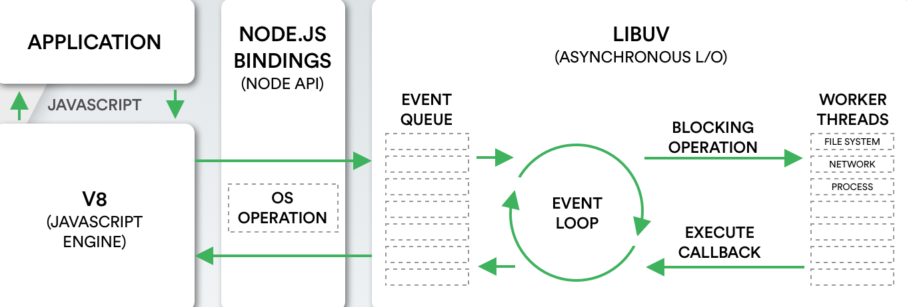
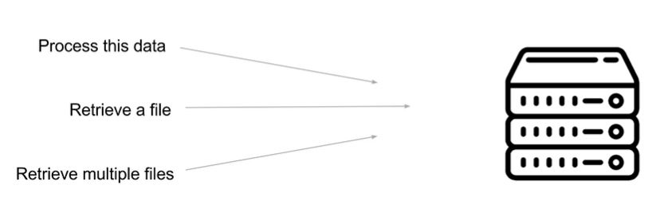

# NodeJSPostgreSQL

# Node

Node is designed to build network applications, It use client-server architecture where a client runs an application that sends and receives data to be processed by a server.



# Javascript Runtime
NodeJS is an asynchronous event driven Javascript runtime, a program that execute instructions while running.\
This lead us to the idea of node being event driven, in this model a program follow the events determined by a user.



# NPM
NPM comes with a neat command called "init", which allows us to create the node project interactively, what follows is a series of questions about the node project :

package name: (first_server)\
version: (1.0.0)\
description:\
entry point: (index.js)\
test command:\
git repository:\
keywords:\
author:\
license: (ISC)

It will create a file named package.json that contains the information above.\
In order to see the content from the command line we can write: 
> cat package.json

this file rappresents the configurations file of the project. 

If you note, the entry point is the index.js file, this means that the root of the project will be a JavaScript file called index.js.\

In this tutorial we create a first folder called "first_server" and from the command line we can write:

> cd first_project \
> npm init

After that you can create a index.js file. \
We will use a module called HTTP for creating a server. \
Modules in node represent packages of code that allow us to add certain features to our JavaScript node application, but in case of HTTP we don't need to install It because is a core model.

We can write:
> const http = require('http');

HTTP stands for Hypertext Transfer Protocol, and it's a standard for transferring data and communicating across the Web.

Move to the ./first_server/index.js for the full code.
REMEMBER for run the server you can write:
>node index


# ES6

Node allows to use ES6 syntax.\
This syntax introduce new feature to JavaScript like error functions and backtick template.
One example is the arrow function, the old syntax was :
> function( ) { };

while the arrow function is:
>( ) => { };

# Nodemon
Nodemon allows to automatically restart our node server whenever you update application
> nom install nodemon --save-dev

-dev is because we will use It in a developement mode.\
You need to add in the package-json file and ad a new key call "dev":"nodemon" in the script part:
````diff
"scripts": {\
"test": "echo \\"Error: no test specified\\" && exit 1",\
+ "dev":"nodemon"
}
````

